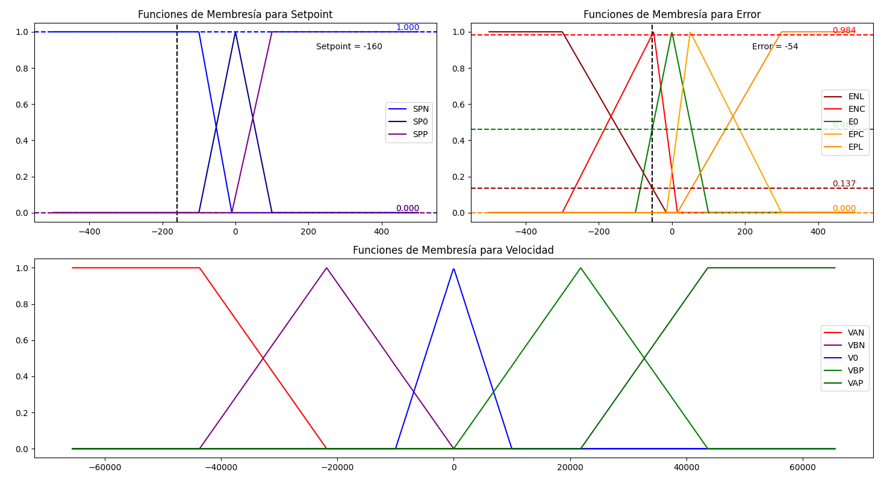
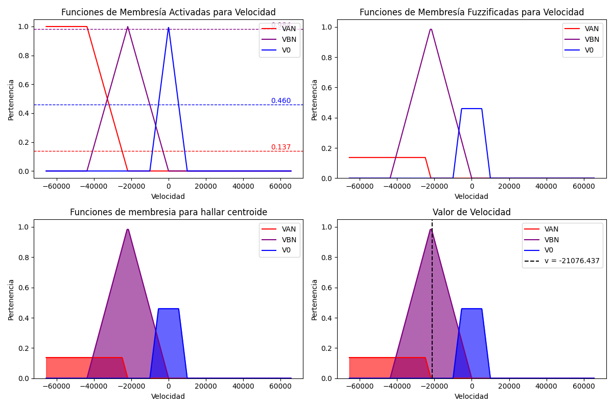

# PIDz_circuitpython
Librería para PID discreto para Circuitpython. Está implementado en un objeto que actualiza los errores pasados y las variables de control dentro de una ecuación de diferencias.

## v1.0

### 
```python
class PID:
    def __init__(self):
        self.reset()
        self.Kp = 0
        self.Ki = 0
        self.Kd = 0
        self.Ts = 0
        self.update()
```
Esta biblioteca de Python proporciona una implementación de controlador PID adecuada para sistemas de control discretos en microcontroladores. El controlador permite ajustar dinámicamente las ganancias proporcionales (Kp), integrales (Ki) y derivadas (Kd) sin llamar explícitamente a una función de actualización. La biblioteca utiliza el módulo numpy de la biblioteca ulab de Circuitpython para realizar cálculos numéricos eficientes.

En esta versión el controlador emplea solo el método de integración trapezoidal para el control PID en tiempo discreto.

$$
c[k] = c[k-1] + q_0 \cdot e[k] + q_1 \cdot e[k-1] + q_2 \cdot e[k-2]
$$

Donde: 

$$
\mathbf{q} = \begin{bmatrix}
q_0 \\
q_1 \\
q_2 \\
\end{bmatrix} 
= \begin{bmatrix}
Kp + \frac{Ki \cdot Ts}{2} + \frac{Kd}{Ts} \\
-Kp + \frac{Ki \cdot Ts}{2} - \frac{2 \cdot Kd}{Ts} \\
\frac{Kd}{Ts} \\
\end{bmatrix}
$$

Este repositorio contiene códigos y librerías para implementar controladores para motor DC con microcontrolador. Los valores utilizados están calibrados segun el enconder y especificaciones técnicas del motor utilizado.

Módulos utilizados:
- Driver L298N.
- Current Sensor (Ejemplo: ACS712 / 5A)
- Hall Sensor (Encoder)

## FuzzyLib
Librería en micropython para implementar una lógica difusa. Las funciones contenidas estan diseñadas para no utlizar linspace debido al tiempo de procesamiento que es mayor a 100 ms en tamaños mayores a 50 aproximadamente, lo cual no es recomendable para control de este sistema. Por ello, se recomienda definir las funciones de membresia de entrada correctamente para que la libreria reconozca los extremos como universos correctamente.
Tomar en cuenta que en la función _Defuzzy(membership_out, universe, n)_ se está usando un linspace de tamaño _n_, por lo que hay que equilibrar entre calidad de precisión y tiempo de procesamiento (n = 50 se llega a 20 ms aprox).

```python
def Defuzzy(membership_out, universe, n):
    ...
    # Se establece la defuzificación por método de centroide
    for i in range(n):
        x = universe[0] + i * delta_x 
        
        max_value = 0.0
        
        for membresia in membership_out.values():
            mf_value = Trapzmf(x, membresia)
            max_value = max(max_value, mf_value)
        
        sumy += max_value
        sumy_x += max_value * x
    
    if sumy == 0:
        return 0.0  
    else:
        return sumy_x / sumy
```

## Próximamente
- Observador de Estados en C++ (Arduino) (en especial para sensar corriente de motor cuando el sensor no es eficiente)
- DQN (Aprendizaje por refuerzo)
 # FuzzyLib
FuzzyLib es una librería que incorpora lógica difusa en CircuitPython. Una de las principales ventajas de utilizar CircuitPython es la inclusión de la biblioteca Ulab con Numpy, lo que nos permite manipular vectores sin utilizar memoria a compración de los arreglos y listas.

## Fuzzy Logic 

Para ilustrar cómo opera la lógica difusa en FuzzyLib, consideremos un ejemplo de control de posición de motor.
En primer lugar, es necesario definir las variables a fuzzificar, que en este caso son el setpoint y el error de posición.
Posteriormente, debemos establecer las funciones de membresía de estas variables. En el código de FuzzyLib beta, esta definición se realizaba mediante tuplas:



Luego, se tienen que definir las Reglas Difusas. Por ejemplo:

- Si el Setpoint es Negativo y el Error es Negativo Alto, entonces la Velocidad es Alta Negativa.
- Si el Setpoint es Positivo y el Error es Negativo Corto, entonces la Velocidad es Baja Negativa.


Finalmente, se aplican las reglas difusas a cada entrada. El resultado es una combinación de trapecios en la salida. Fuzzy Lib identifica los valores fuzzificados de la salida y los defuzzifica utilizando el método del centroide para obtener el valor final de la salida. 



Ya con la idea de cómo funciona La lógica Difusa en FuzzyLib, te invito a revisar la documentación sobre las versiones.

## FuzzyLib beta

La versíon Beta de FuzzyLib no usa Circuitpython por lo que se puede utilizar tambien en Micropython. Las funciones de membresía se declaran en tuplas y las reglas difusas en una matriz de listas.

```python
# Definir Universos de entrada (error y setpoint) y salida (datacycle)
sp = (-500, 500)
e = (-500, 500)
v = (-65535, 65535)

# Definir las funciones de membresía de entrada
SPN = (-500, -500, -100, -10)  # Setpoint Negativo
SP0 = (-100, 0, 100)            # Setpoint Cero
SPP = (-10, 100, 500, 500)      # Setpoint Positivo
SP = [SPN, SP0, SPP]

ENL = (-500, -500, -300, -15)  # Error Negativo Lejano
ENC = (-300, -50, 15)          # Error Negativo Cercano
E0 = (-100, 0, 100)            # Error Cero
EPC = (-15, 50, 300)           # Error Positivo Cercano
EPL = (15, 300, 500, 500)      # Error Positivo Lejano
E = [ENL, ENC, E0, EPC, EPL]

# Definir las funciones de membresía de salida
VAN = (-65535, -65535, -43690, -21845)   # Velocidad Alta Negativa
VBN = (-43690, -21845, 0)                # Velocidad Baja Negativa
V0 = (-10000, 0, 10000)                  # Velocidad Cero
VBP = (0, 21845, 43690)                  # Velocidad Baja Negativa
VAP = (21845, 43690, 65535, 65535)       # Velocidad Alta Positiva
V = [VAN, VBN, V0, VBP, VAP]

# Definir las Reglas
R = [(SPN, ENL, VAN),
     (SPN, ENC, VBN),
     (SPN,  E0,  V0),
     (SPN, EPC, VBP),
     (SPN, EPL, VAP),
     (SP0, ENL, VAN),
     (SP0, ENC, VBN),
     (SP0,  E0,  V0),
     (SP0, EPC, VBP),
     (SP0, EPL, VAP),
     (SPP, ENL, VAN),
     (SPP, ENC, VBN),
     (SPP,  E0,  V0),
     (SPP, EPC, VBP),
     (SPP, EPL, VAP)]
```
Es importante señalar que en esta versión solo se puede utilizar el operador "and".
Luego, se aplica el siguiente código para la salida difusa:
```python
Val = Fuzzy(R, x, (SP, E))
Lines_cut = Proyect(Val)
Trapezoids = Cut(Lines_cut, Val)
Vf = Defuzzy(Trapezoids, v, 100)
```

```python
def Fuzzy(rules, x, variables_input), donde:
```
- *rules*: Matriz de Reglas
- *x*: Vector de entrada del bloque difuso
- *variables_input*: Tupla con las entradas, cada entrada una lista con sus funciones de membresía
- Salida: La función retorna un diccionario cuyas claves eran las tuplas de las funciones de membresía de salida y las claves sus valores de corte.

```python
def Proyect(membership_out_values)
```
- *membership_out_values*: Salida de la función Fuzzy.
- Salida: El código retorna un diccionario cuyas claves son las tuplas de la funciones de membresía de salida y las claves otra tupla con los nuevos puntos de las funciones de membresía cortados por sus valores de proyección.

```python
def Cut(membership_out_proyect, membership_out_values)
```
- *membership_out_values*: Salida de la función Fuzzy.
- *membership_out_proyect*: Salida de la función Proyect.
- Salida: La función retorna un diccionario cuyas tuplas son las tuplas de las funciones de membreía de salida y las claves una lista con lo puntos de las funciones de membresía cortados por sus valores de proyección concatenados con el valor de proyección.

```python
def  Defuzzy(membership_out_proyect_values, universe_out, n)
```
- *membership_out_proyect_values*: Salida de la función Cut.
- *universe out*: Lista de los extremos del universo de salida.
- *n*: Número de divisiones sobre el universo de salida.
- Salida: La función retorna el centroide del poligono resultante de los trapecios de las funcuiones de membresía de salida.

## FuzzyLib v1.0

Ahora con Ulab Numpy integrado

```python
# Definir las funciones de membresía de entrada
EN = fuzzy_membership((-Emax, -Emax, -150, -20), 'trapezoidal')
EZ = fuzzy_membership((-50, 0, 50), 'triangular')
EP = fuzzy_membership((20, 150, Emax, Emax), 'trapezoidal'

DN = fuzzy_membership((-DEmax, -DEmax, -50, -5), 'trapezoidal')
DZ = fuzzy_membership((-20, 0, 20), 'triangular')
DP = fuzzy_membership((5, 50, DEmax, DEmax), 'trapezoidal')

# Definir las funciones de membresía de esalida
VAN = fuzzy_membership((-65535, -65535, -40000, -20000), 'trapezoidal')
VBN = fuzzy_membership((-30000, -10000, 0), 'triangular')
V0  = fuzzy_membership((-5000, 0, 5000), 'triangular')
VBP = fuzzy_membership((0, 10000, 30000), 'triangular')
VAP = fuzzy_membership((20000, 40000, 65535, 65535), 'trapezoidal')
```
